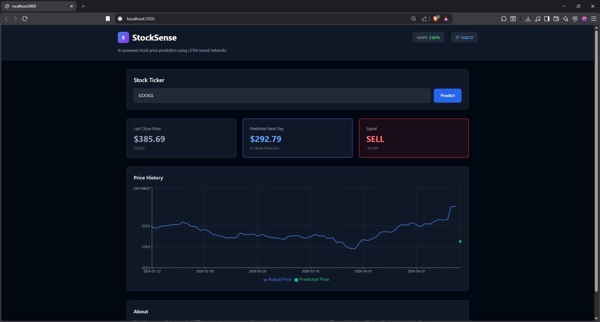

# StockSense 📈

**AI-powered stock price prediction using LSTM neural networks**

A full-stack application combining a PyTorch LSTM model with FastAPI backend and Next.js frontend for real-time stock price predictions based on technical analysis.

---

## 🎯 Project Overview

StockSense leverages deep learning to predict stock prices by analyzing 15 technical indicators over a 60-day window. The system fetches live market data from Yahoo Finance, calculates technical features, and uses a trained LSTM model to forecast the next day's price.

### Model Performance Metrics

| Metric | Value |
|--------|-------|
| **RMSE** | $10.30 |
| **MAE** | $8.19 |
| **MAPE** | 3.82% |
| **R²** | 0.8272 |

### Key Features

- ✅ **Real-time Predictions** - Get stock price forecasts instantly
- ✅ **90-day Historical Charts** - Visualize actual vs predicted prices
- ✅ **Trading Signals** - BUY/SELL/HOLD recommendations
- ✅ **Technical Indicators** - 15 engineered features including SMAs, EMAs, RSI, MACD, Bollinger Bands
- ✅ **Dark UI Dashboard** - Modern, responsive design with Tailwind CSS
- ✅ **REST API** - Fully documented FastAPI endpoints

---

## 📸 Dashboard Preview

The StockSense dashboard provides an intuitive interface for stock price predictions:



**Dashboard Features:**
- **Real-time Predictions**: Enter any ticker symbol and get instant price forecasts
- **Signal Indicators**: Clear BUY/SELL/HOLD signals with percentage change predictions
- **Historical Charts**: 90-day price history with overlay of AI model predictions
- **Model Metrics**: Displays MAPE (3.82%) and R² (0.8272) for model confidence assessment
- **Dark Theme UI**: Optimized for comfortable viewing with professional styling

**Example Prediction (GOOGL):**
- Last Close Price: $385.69
- Predicted Next Day: $292.79
- Signal: **SELL** (-24.09%)
- Chart: Shows 90-day historical trend with predicted price point

---

## 🏗️ Project Structure

```
STOCKSENSE/
├── backend/
│   ├── stocksenseModel/
│   │   ├── best_model.pth          # Trained PyTorch LSTM weights
│   │   ├── feature_scaler.pkl      # MinMaxScaler for 15 features
│   │   ├── target_scaler.pkl       # MinMaxScaler for Close prices
│   │   └── features.json           # Feature names list
│   ├── main.py                     # FastAPI application
│   └── requirements.txt            # Python dependencies
├── frontend/
│   ├── src/
│   │   ├── pages/
│   │   │   ├── _app.tsx            # Next.js app wrapper
│   │   │   └── index.tsx           # Main dashboard page
│   │   ├── components/
│   │   │   ├── Header.tsx          # App header with metrics
│   │   │   ├── PredictionForm.tsx  # Ticker input form
│   │   │   ├── StatCard.tsx        # Stat display cards
│   │   │   ├── PriceChart.tsx      # Interactive price chart
│   │   │   └── Skeleton.tsx        # Loading skeletons
│   │   ├── lib/
│   │   │   └── api.ts              # Axios API client
│   │   ├── types/
│   │   │   └── index.ts            # TypeScript interfaces
│   │   └── styles/
│   │       └── globals.css         # Global styles
│   ├── public/                     # Static assets
│   ├── package.json
│   ├── next.config.js
│   ├── tailwind.config.js
│   └── tsconfig.json
└── README.md
```

---

## 🛠️ Tech Stack

### Backend
- **Framework**: FastAPI 0.104.1
- **Server**: Uvicorn
- **ML Model**: PyTorch 2.0.1
- **Data Processing**: pandas 2.0.3, NumPy 1.24.3
- **Data Source**: yfinance 0.2.32
- **Scaling**: scikit-learn 1.3.1

### Frontend
- **Framework**: Next.js 14
- **Language**: TypeScript 5.2
- **Styling**: Tailwind CSS 3.3
- **Charts**: Recharts 2.10
- **HTTP Client**: Axios 1.6
- **Styling**: Tailwind CSS for dark theme

---

## 🚀 Getting Started

### Prerequisites
- **Python 3.8+** (for backend)
- **Node.js 16+** (for frontend)
- **npm** or **yarn**

### Backend Setup

1. **Navigate to backend directory**
   ```bash
   cd backend
   ```

2. **Create virtual environment**
   ```bash
   python -m venv venv
   source venv/Scripts/activate  # Windows: venv\Scripts\activate
   ```

3. **Install dependencies**
   ```bash
   pip install -r requirements.txt
   ```

4. **Run the server**
   ```bash
   uvicorn main:app --reload --port 8000
   ```

   The API will be available at: `http://localhost:8000`
   - API Docs: `http://localhost:8000/docs` (Swagger UI)
   - ReDoc: `http://localhost:8000/redoc`

### Frontend Setup

1. **Navigate to frontend directory**
   ```bash
   cd frontend
   ```

2. **Install dependencies**
   ```bash
   npm install
   ```

3. **Set environment variables**
   
   The `.env.local` file is pre-configured for local development:
   ```env
   NEXT_PUBLIC_API_URL=http://localhost:8000
   ```

4. **Run development server**
   ```bash
   npm run dev
   ```

   The frontend will be available at: `http://localhost:3000`

5. **Build for production**
   ```bash
   npm run build
   npm start
   ```

---

## 📡 API Endpoints

### 1. Health Check
```bash
GET /
```
Returns model status and metrics.

**Response:**
```json
{
  "status": "healthy",
  "model_loaded": true,
  "rmse": 10.30,
  "mae": 8.19,
  "mape": 3.82,
  "r2": 0.8272
}
```

---

### 2. Get Metrics
```bash
GET /metrics
```
Returns detailed model performance metrics.

**Response:**
```json
{
  "rmse": 10.30,
  "mae": 8.19,
  "mape": 3.82,
  "r2": 0.8272,
  "features_count": 15,
  "sequence_length": 60
}
```

---

### 3. Predict Stock Price
```bash
GET /predict/{ticker}
```

Downloads last 120 days of data, builds technical indicators, and predicts next day's price.

**Parameters:**
- `ticker` (string, path): Stock ticker symbol (e.g., "AAPL", "GOOGL", "TSLA")

**Response:**
```json
{
  "ticker": "AAPL",
  "last_close": 189.95,
  "predicted_price": 192.35,
  "change_pct": 1.26,
  "signal": "BUY",
  "timestamp": "2024-01-15T14:30:00"
}
```

**Signal Interpretation:**
- **BUY**: Predicted change > +2%
- **SELL**: Predicted change < -2%
- **HOLD**: Predicted change between -2% and +2%

---

### 4. Get Historical Price Data
```bash
GET /history/{ticker}?days=90
```

Retrieves historical price data for charting.

**Parameters:**
- `ticker` (string, path): Stock ticker symbol
- `days` (integer, query): Number of days to retrieve (1-365, default: 90)

**Response:**
```json
{
  "ticker": "AAPL",
  "dates": ["2024-01-01", "2024-01-02", ...],
  "prices": [189.50, 189.95, ...]
}
```

---

## 🧠 Model Architecture

### LSTM Model Details

```
Input: (batch_size, 60, 15)
  ↓
2-Layer Stacked LSTM (hidden_size=128, dropout=0.2)
  ↓
BatchNorm1d(128)
  ↓
Linear(128 → 64) + ReLU
  ↓
Dropout(0.2)
  ↓
Linear(64 → 1)
  ↓
Output: Scaled price value
```

### Features (15 Technical Indicators)

1. **Close** - Stock closing price
2. **Volume** - Trading volume
3. **SMA_10** - 10-day Simple Moving Average
4. **SMA_20** - 20-day Simple Moving Average
5. **SMA_50** - 50-day Simple Moving Average
6. **EMA_12** - 12-day Exponential Moving Average
7. **EMA_26** - 26-day Exponential Moving Average
8. **MACD** - MACD line (EMA_12 - EMA_26)
9. **MACD_Signal** - MACD Signal line (9-day EMA of MACD)
10. **RSI** - Relative Strength Index (14-period)
11. **BB_width** - Bollinger Bands width
12. **Daily_Return** - Daily percentage return
13. **Price_Range_Pct** - (High - Low) / Close
14. **Volatility_10** - 10-day rolling volatility
15. **Volatility_20** - 20-day rolling volatility

### Feature Scaling

- **Features**: MinMaxScaler fitted on training data (feature_scaler.pkl)
- **Target (Close)**: MinMaxScaler fitted on training data (target_scaler.pkl)
- All predictions are inverse-transformed for interpretation

---

## 🖼️ Dashboard Features

### Header
- StockSense logo and branding
- Real-time model metrics display (MAPE, R²)
- Status indicator

### Prediction Section
- Ticker input with autocomplete suggestions
- Predict button with loading state
- Real-time predictions

### Statistics Cards
- **Last Close Price**: Current market price
- **Predicted Price**: Model's next-day prediction
- **Trading Signal**: BUY/SELL/HOLD with color coding
- **Change %**: Expected percentage change

### Price Chart
- 90-day historical price line
- Predicted next-day price as distinct marker
- Interactive tooltips
- Responsive design
- Dark theme optimized

### Loading States
- Skeleton loaders for better UX
- Smooth transitions
- Error handling with user feedback

---

## ⚙️ Configuration

### Backend Configuration

Edit `backend/main.py` to customize:

```python
# Model hyperparameters
hidden_size = 128          # LSTM hidden units
num_layers = 2             # Number of LSTM layers
dropout = 0.2              # Dropout rate
sequence_length = 60       # Input sequence length

# Trading signal thresholds
BUY_THRESHOLD = 2.0        # % change threshold
SELL_THRESHOLD = -2.0      # % change threshold
```

### Frontend Configuration

Edit `frontend/.env.local`:

```env
NEXT_PUBLIC_API_URL=http://localhost:8000
```

---

## 🐛 Troubleshooting

### Backend Issues

**Model not loading:**
```
Check if all artifact files exist:
- backend/stocksenseModel/best_model.pth
- backend/stocksenseModel/feature_scaler.pkl
- backend/stocksenseModel/target_scaler.pkl
- backend/stocksenseModel/features.json
```

**CUDA errors:**
```bash
# Install CPU-only version of PyTorch
pip install torch==2.0.1 --index-url https://download.pytorch.org/whl/cpu
```

**Port already in use:**
```bash
# Use different port
uvicorn main:app --port 8001
```

### Frontend Issues

**API not responding:**
- Ensure backend is running on port 8000
- Check NEXT_PUBLIC_API_URL in .env.local
- Check CORS configuration in backend/main.py

**Build errors:**
```bash
rm -rf .next node_modules
npm install
npm run build
```

---

## 📊 Example Usage

### Predict Apple Stock
```bash
curl http://localhost:8000/predict/AAPL
```

### Get 60 days of history
```bash
curl "http://localhost:8000/history/AAPL?days=60"
```

### Check model metrics
```bash
curl http://localhost:8000/metrics
```

---

## 🔒 CORS & Security

- **CORS Enabled**: `http://localhost:3000`, `http://localhost:3001`
- **Rate Limiting**: Not implemented (add in production)
- **Authentication**: Not implemented (add for production deployment)

For production deployment, update CORS settings in `backend/main.py`:

```python
allow_origins=["yourdomain.com", "www.yourdomain.com"]
```

---

## 📝 Notes & Disclaimers

⚠️ **Important**: This model is for educational purposes and should not be used as the sole basis for investment decisions. Stock markets are complex and influenced by numerous factors beyond technical analysis.

### Model Limitations
- Trained on historical data (past performance ≠ future results)
- Accuracy varies by market conditions
- MAPE of 3.82% assumes similar market dynamics
- Does not account for earnings announcements, geopolitical events, etc.

### Best Practices
- Use predictions in combination with fundamental analysis
- Verify predictions with multiple models
- Monitor model performance regularly
- Retrain periodically with new data

---

## 🚀 Deployment

### Deploy Backend (Heroku/Railway)

1. Create `Procfile`:
   ```
   web: uvicorn main:app --host 0.0.0.0 --port $PORT
   ```

2. Push to platform:
   ```bash
   git push heroku main
   ```

### Deploy Frontend (Vercel)

1. Push to GitHub
2. Connect repository to Vercel
3. Set environment variable:
   ```
   NEXT_PUBLIC_API_URL=https://your-backend-url.com
   ```

---

## 📄 License

This project is provided as-is for educational purposes.

---

## 👨‍💻 Author

Built with ❤️ for stock market enthusiasts and ML practitioners.

**Questions?** Check the API docs at `/docs` or review the model training notebook at `backend/stocksenseModel/StockSense_.ipynb`
